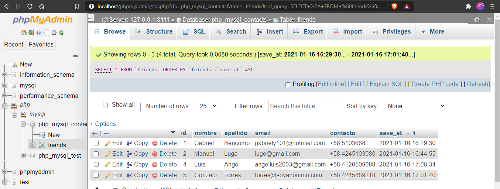

# PHP &amp; MYSQL CONTACTS APP
Repo for php &amp; mysql app that can Create, Read, Update and Delete contact info such as: Name, Last Name, Email and contact number. 
# Página Principal

# Base de Datos

# Requerimientos
- [xampp](https://www.apachefriends.org/es/download.html#)
- [git](https://git-scm.com)
# Usage
En el archivo includes/config.php esta la configuracion de las variables globales, puedes editarlo con la configuracion de tu sistema.

Puedes cambiar los siguientes valores:

1. El puerto de la instancia de mysql
2. Usuario de mysql
3. Clave del usuario

### Ejemplo
~~~
$host = 'localhost:8111';    
$usuario = 'root';           
$clave = '';
~~~

En la carpeta database estan 2 scripts para la creación de las bases de datos sql. 
Solo tienes que insertar el archivo sql en el manejador de base de datos de tu preferencia para crear la base de datos.
Para tener la app activa solo tienes que agregar el carpeta del proyecto a la carpeta de xampp llamada htdocs e ir a [localhost/php_mysql_contacts_app](https://github.com/gabrielba15/php_mysql_contacts_app/blob/master/README.md#Usage)

# Para tener activa la app
1. Clonar repositorio con git, GitHub CLI o descargar la carpeta comprimida.
~~~ 
# cmd 
~~~
~~~
 cd %USERPROFILE%\Desktop 
~~~ 
~~~
git clone https://github.com/gabrielba15/php_mysql_contacts_app.git 
~~~ 
2. Mover o copiar la carpeta clonada a la carpeta htdocs de xampp
3. Crea la base de datos si no la haz creado aun (php_mysql_contacts.sql).
4. Cambia los valores de config.php
5. Ve a localhost/php_mysql_contacts_app en tu navegador.
6. Listo, happy hacking crack :D
